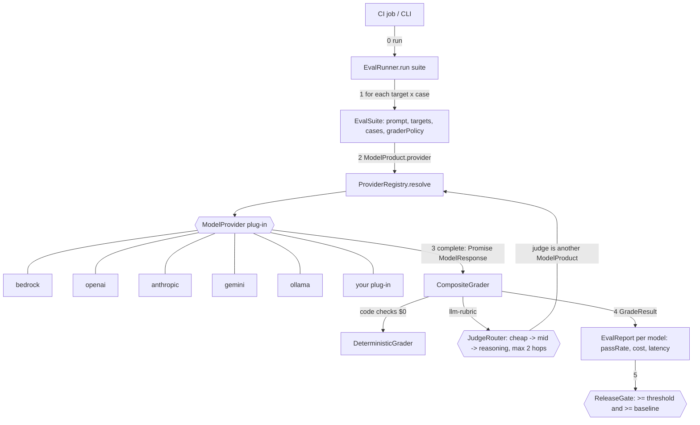

# evalladder spec (v0.1)

Goal: test any AI model the same way, the way UI plug-ins are tested: one shared contract, one plug-in per vendor, every plug-in passes the same suite.

## Decisions

| # | Decision | Why |
|---|---|---|
| D1 | One npm package `evalladder` with subpath layers: `core` (contract + DTOs), `testkit` (shared tests), `promptfoo` (base plug-in), one subpath per vendor. | Same layering as a core-models / base-plugin / per-feature-plugin setup, without needing an npm org. Vendor code loads only when imported. |
| D2 | Every vendor is a `ModelProviderPlugin` (`key` + `create(product)`). Plug-ins extend `AbsModelProvider` and implement only `doComplete()`. | Interface -> abstract base -> implementation. Timing, cost and the error rule live in one place. |
| D3 | A model is a `ModelProduct` config object (provider, modelId, tier, price, options). No raw secrets in it. | Add a model = add a row. Credentials stay in each vendor's normal chain (env, AWS OIDC). |
| D4 | Built-in vendor plug-ins call promptfoo's `loadApiProvider()`. promptfoo is a peer dependency, not bundled. | promptfoo already handles 60+ vendors; we add what it lacks. |
| D5 | Our own runner instead of `promptfoo.evaluate()`. | promptfoo cannot escalate the judge across tiers or report cost per target the way we need. Vendor calls still go through promptfoo. |
| D6 | Failing case resolves `pass:false`; only `InfraError` rejects. Retryable infra errors retry with backoff (default 2); auth/config errors don't. | Grading problems are results, not crashes. |
| D7 | `Promise.allSettled` over target x case, bounded concurrency (default 4). | One bad case or model never kills the run. |
| D8 | Code assertions first; judge only if they pass. | Saves judge cost. |
| D9 | JudgeRouter: judges listed cheapest first; escalate on infra error, unparseable JSON, or score within `nearThresholdBand` of `threshold`; `maxHops` default 2; skip any judge equal to the model under test. If every judge fails, the case resolves `pass:false` "ungraded". | Cheap by default, accurate when it matters, no self-grading. |
| D10 | ReleaseGate per model: `passRate >= threshold` and `>= baseline - tolerance`. Errored cases count as not passed. | A model can't regress silently; infra outages fail loud. |
| D11 | Shared conformance suite (`runProviderConformance`) runs offline against a fake transport for every plug-in, plus an optional live call when `EVALLADDER_LIVE_<VENDOR>_MODEL` is set. | Same tests for every model; CI needs no keys. |
| D12 | MIT. Node >= 22.22 (promptfoo's floor). ESM only. | |

## Flow



## Contract (packages/core/src/types.ts)

```ts
interface ModelProduct { id; provider; modelId; tier?: 'cheap'|'mid'|'reasoning'; priceInPer1M?; priceOutPer1M?; options? }
interface ModelProviderPlugin { key: string; create(p: ModelProduct): ModelProvider }
interface ModelProvider { product: ModelProduct; complete(req: PromptRequest): Promise<ModelResponse> }  // rejects only InfraError
interface Grader { grade(tc: TestCase, out: ModelResponse): Promise<GradeResult> }                     // never rejects for a failing case
interface EvalRunner { run(suite: EvalSuite): Promise<EvalReport> }

type PromptRequest = { prompt; system?; maxTokens?; temperature? }
type ModelResponse = { text; productId; modelId; inputTokens; outputTokens; costUsd; latencyMs }
type TestCase      = { id; vars: Record<string,string>; assertions: Assertion[] }
type Assertion     = equals | contains | not-contains | regex | is-json | javascript(fn) | llm-rubric(rubric)
type GraderPolicy  = { tiers: ModelProduct[]; maxHops?=2; threshold?=0.7; nearThresholdBand?=0.1 }
type EvalSuite     = { suiteId; prompt: PromptVersion; targets: ModelProduct[]; cases; graderPolicy?; passThreshold; concurrency?=4; retries?=2; request? }
type GradeResult   = { pass; score 0..1; reason; graderModelId?; hops?; graderCostUsd? }
type CaseResult    = { caseId; productId; modelId; response?; grade; error? }
type ModelSummary  = { productId; provider; modelId; passed; failed; errored; passRate; modelCostUsd; graderCostUsd; totalCostUsd; avgLatencyMs }
type EvalReport    = { suiteId; promptId; startedAt; finishedAt; byModel: ModelSummary[]; results: CaseResult[]; totalCostUsd }
type GateDecision  = { pass; models: { productId; passRate; threshold; baseline?; pass; reason }[] }
```

## Out of scope for v0.1

Streaming, tool-call assertions, multi-turn conversations, dataset files (CSV/YAML), HTML viewer (use promptfoo's), caching of model responses.
